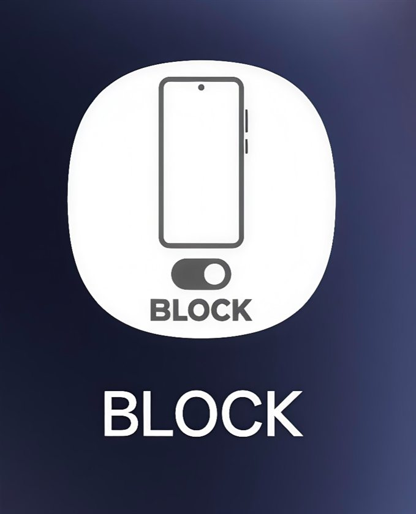
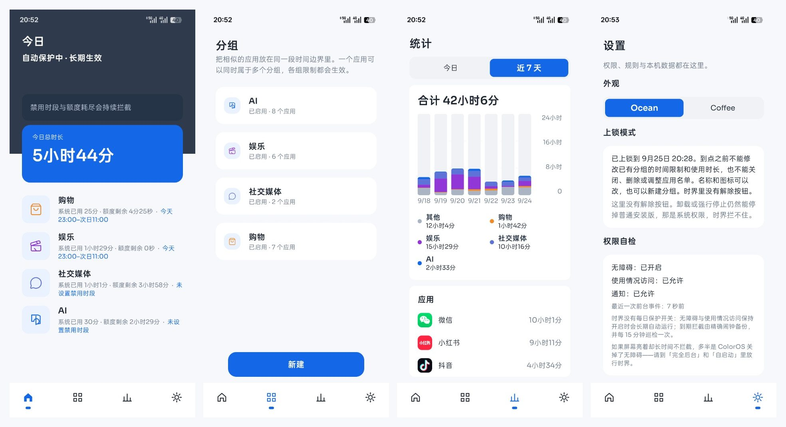
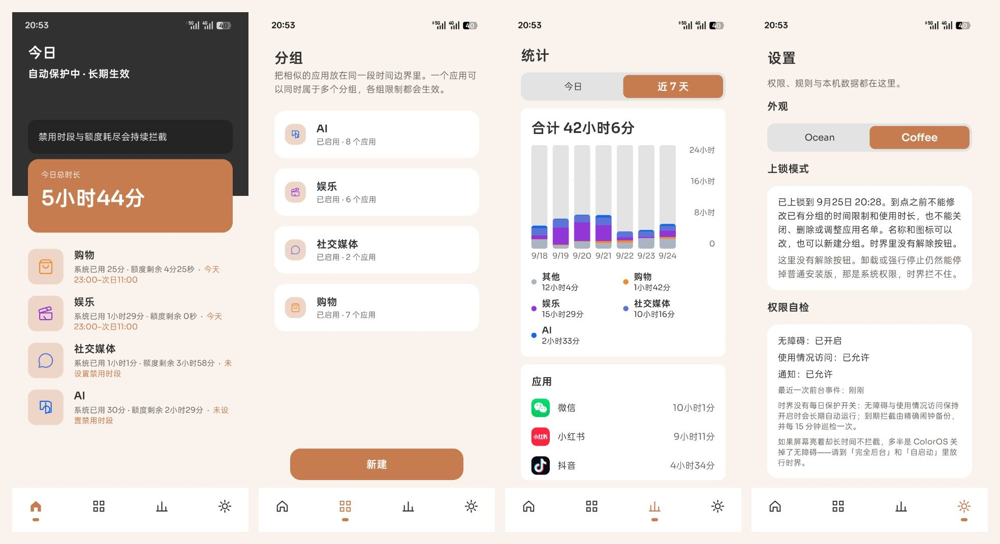
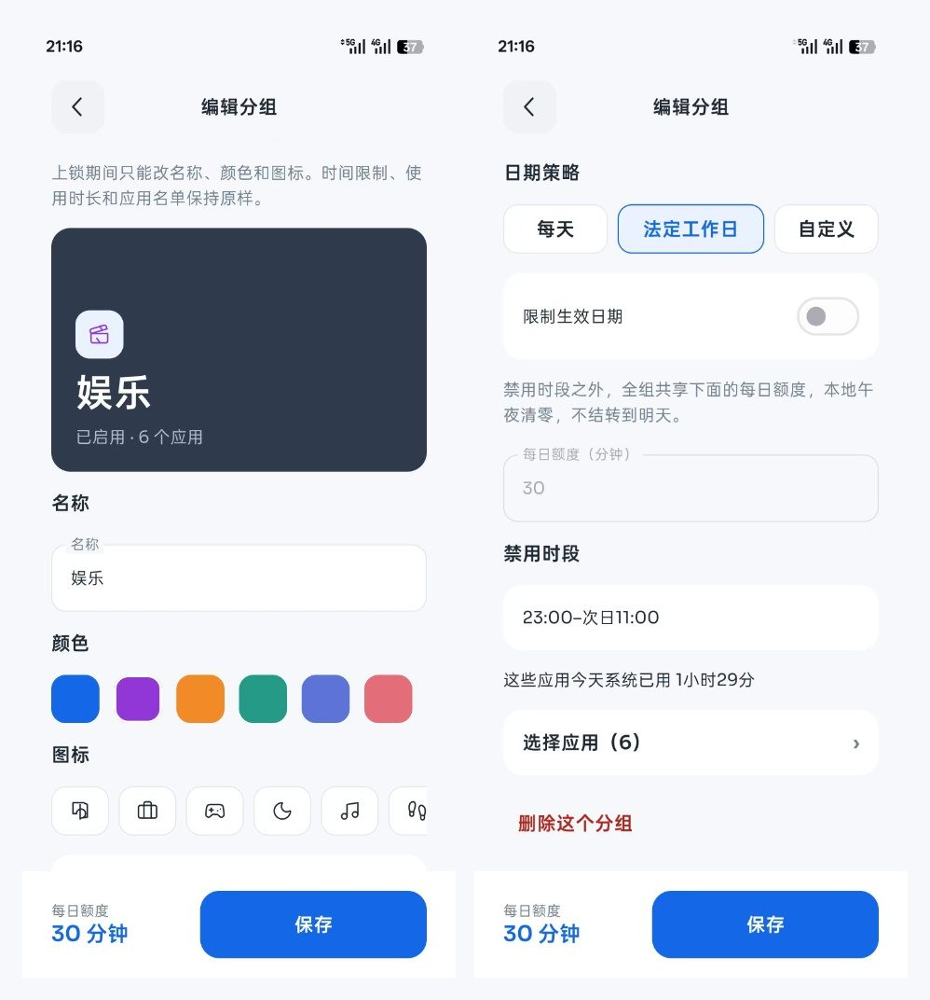

# BLOCK

[English](README.en.md)

<p align="center"></p>

BLOCK（时界）是一个完全离线的 Android 应用。它按你设定的禁用时段和每日额度，在被限制的应用来到前台时把它送回桌面，并挡住继续使用。

安装包不申请联网权限，没有账号、广告或云同步。规则、使用时长和放行记录只留在这台手机上，默认保存 30 天。

当前版本 **2.0.7**（versionCode 13）。安装包在 [`dist/时界-release.apk`](dist/时界-release.apk)。

```text
SHA-256 142c6eba246afff6ddfbd96f7edf27c2155abe8706c1da61ebe596ac58eda21e
```

本项目以[非商业许可](LICENSE)发布：可以出于非商业目的使用，不得出售或用于经营活动。

## 使用方式

1. 把 `dist/时界-release.apk` 拷到手机，从文件管理器安装。若系统拦截未知来源，到该来源应用的设置里允许安装未知应用。
2. 打开 BLOCK，按引导页依次确认：数据只留在手机上、使用情况访问、无障碍、可选通知，以及后台保持运行。
3. 最后一页勾选「关闭无障碍、强行停止或卸载后，限制会失效」，才能进入主页。
4. 在「分组」里把想放慢的应用放进同一组，设置禁用时段和每日额度。
5. 打开一个被限制的应用。到了禁用时段，或这一组的额度用完，BLOCK 会回到桌面并弹出拦截页。

无障碍只在窗口切换时读取前台应用的包名，不读屏幕文字、输入内容或控件树。使用情况访问用来累计前台时长，不读取通知内容。

关闭无障碍、强行停止或卸载之后，限制会马上失效。BLOCK 不能在系统层禁止启动应用，也不能阻止你关掉这些权限。

ColorOS 16 上还需要允许完全后台运行、打开自启动，并锁定最近任务。逐步路径写在 [docs/安装与ColorOS配置.md](docs/安装与ColorOS配置.md)。

### 额度怎么算

时长来自系统记录的前台事件：应用来到前台开始计，离开前台结束。灭屏会结束这一段。系统应用不计入。数字按本地午夜切天，并写进手机上的数据库；下次打开只补上次之后的新记录。

一组里的应用共用一个每日额度，本地午夜清零，不结转到第二天。一个应用可以同时属于多个分组，只要其中一组生效，这个应用就会被拦截。电话、桌面、系统界面、设置、安装器和 BLOCK 本身不能加入分组。

判断顺序是：安全应用 → 应急放行 → 禁用时段 → 每日额度 → 允许。

### 应急放行

拦截页上，每个分组每天可以放行一次。需要填写理由，并等待 30 秒，然后只放行这一个应用 5 分钟。放行期间仍计入额度。重启手机后，这次放行立刻取消。

### 上锁

设置里可以把已有分组锁到明天 0 点、24 小时或 7 天。锁定期内不能改这些分组的时间、额度、应用名单，也不能关闭或删除它们。名称和图标仍可修改，也可以新建分组。到点之前，应用里没有解锁按钮。

## 页面

底部有四个入口。从左到右是今日、分组、统计、设置。



Ocean



Coffee

### 今日

主页。上方是保护状态和今天的总前台时长。下面是每个分组：已用时长、额度剩余，以及今天的禁用时段。权限没开时，这里会指出还缺无障碍或使用情况访问。

### 分组

分组列表，以及新建、编辑分组。每一组可以选择名称、颜色、图标、是否启用、生效日期、每天 / 法定工作日 / 自定义星期、多条禁用时段，以及每日额度（分钟）。时段可以跨过午夜，重叠的会合并。编辑页会显示这一组今天已经用掉的系统前台时间。



### 统计

「今日」是 24 小时的柱状图和应用排行。「近 7 天」是每天的合计和排行。时长只显示到分钟。系统应用不出现在这里。

### 设置

- **外观**：Ocean（蓝色）和 Coffee（咖啡店色板，01 `#C67C4E`、02 `#EDD6C8`、03 `#313131`、04 `#E3E3E3`、05 `#F9F2ED`）。
- **上锁模式**：锁住已有分组的规则。
- **权限自检**：无障碍、使用情况访问、通知，以及最近一次前台事件。
- **ColorOS / 后台引导**：打开系统里对应的设置页。
- **法定工作日修正**：已内置中国大陆 2025 与 2026 年的放假和调休，可以按天改成工作日或休息日。没覆盖的年份按周一到周五计算。
- **隐私说明**，以及清除全部分组和记录、回到首次引导。

### 首次引导

安装后的五步说明：完全离线、使用情况访问、无障碍、可选通知、后台保活。完成前不会进入上面的四个页面。

### 拦截页

被限制的应用切到前台时出现。上面写着分组名称和原因（禁用时段或额度用完）。可以关掉它回到桌面；符合条件时也可以申请当天这一次应急放行。页面颜色跟随当前的 Ocean 或 Coffee 主题。

## 构建

运行中的应用不联网。只有在电脑上编译时才需要下载依赖。

```text
powershell -ExecutionPolicy Bypass -File .\scripts\bootstrap.ps1
powershell -ExecutionPolicy Bypass -File .\scripts\build-release.ps1
```

`scripts/bootstrap.ps1` 会在 `work/` 准备 JDK 17 和 Android SDK 36。`minSdk` 是 29，`compileSdk` / `targetSdk` 是 36。签名密钥在本机的 `keystore/`，这个目录里的密钥和密码不会进入仓库。后续升级必须用同一把密钥，否则系统会拒绝覆盖安装。

## 许可

Copyright (c) 2026 Existere

本仓库以非商业许可授权。可以出于非商业目的使用、复制和修改，并需要保留版权声明和许可全文。不得出售、放进收费产品，或用于经营活动。完整文本见 [LICENSE](LICENSE)。软件按「原样」提供，不含任何保证。
